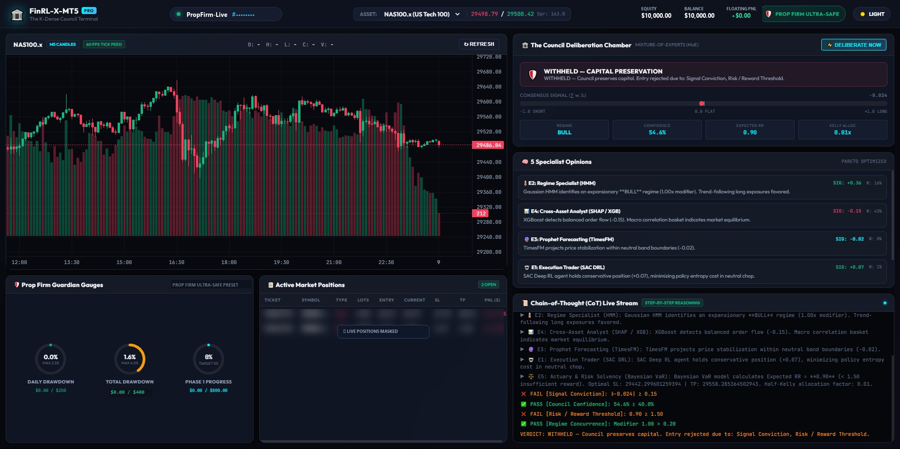
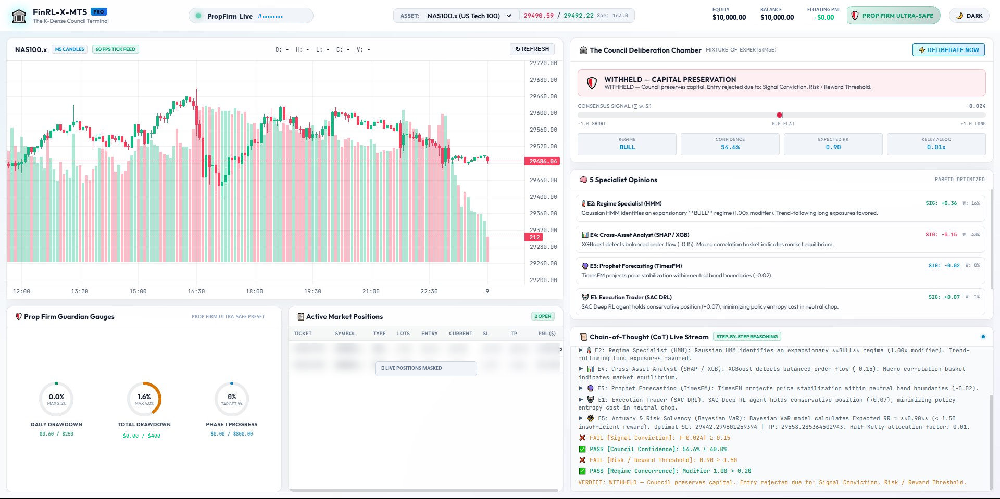

# 🏛️ FinRL-X-MT5
### *K-Dense Council: Multi-Agent Mixture-of-Experts Trading System for MetaTrader 5*

<p align="left">
  <a href="https://primeclub-quant.vercel.app"></a>
  <a href="https://primeclub-quant.vercel.app/#pricing"></a>
  <a href="https://t.me/primeclubsignals_public"></a>
  <a href="https://discord.gg/Ch3DxJ2Bb"></a>
</p>

[](https://python.org)
[](https://pytorch.org)
[](https://www.metatrader5.com)
[](https://pola.rs)
[](#-architecture-overview)
[](LICENSE)

> 🌐 **Official Production Platform & Monetization Portal:** [primeclub-quant.vercel.app](https://primeclub-quant.vercel.app)  
> Access real-time multi-agent deliberations, interactive prop challenge drawdown calculators, daily institutional recaps, and pre-trained production model checkpoints.

**FinRL-X-MT5** is an institutional-grade algorithmic trading framework that adapts the Deep Reinforcement Learning principles of [FinRL](https://github.com/AI4Finance-Foundation/FinRL) to **MetaTrader 5**. 

It eliminates standard single-agent failure modes through the **K-Dense Council**: a 5-expert **Mixture-of-Experts (MoE)** architecture with **NSGA-III Pareto-optimal gating**, fusing high-frequency order-book microstructure with cross-asset equity/macro fundamental flows under the **100% Real Ticks** backtesting standard.

---

## 🖥️ Live Council Terminal & Dashboard

FinRL-X-MT5 features a high-performance local web dashboard with real-time TradingView Lightweight Charts, a live 5-expert deliberation room, prop firm guardian circuit breaker gauges, and an autonomous step-by-step Chain-of-Thought (CoT) reasoning stream.

<p align="center">
  
  <br>
  <em>Dark Mode: Real-time Multi-Agent Deliberations, Prop Firm Guardian Gauges & Step-by-Step CoT Stream</em>
</p>

<p align="center">
  
  <br>
  <em>White Mode: Clean Institutional Layout with Precision Tick Feed & Solvency Meters</em>
</p>

---

## 📚 Quantitative Research & Engineering Whitepapers

Explore our comprehensive technical whitepapers covering machine learning topology, actuarial risk bounds, and regime classification:

* 📑 **[Multi-Agent Reinforcement Learning for MetaTrader 5](docs/articles/01_MULTI_AGENT_REINFORCEMENT_LEARNING_MT5.md):** Overcoming single-agent non-stationarity via the 5-Specialist Council and NSGA-III Pareto gating.
* 🛡️ **[Defensive Capital Allocation & 0.50% Drawdown Guards](docs/articles/02_DEFENSIVE_CAPITAL_ALLOCATION_DRAWDOWN_GUARDS.md):** Mathematical position sizing, circuit breakers, and surviving prop firm evaluation limits.
* 📈 **[Hidden Markov Models (HMM) for Regime Detection on NAS100](docs/articles/03_HMM_REGIME_DETECTION_NAS100.md):** Gaussian HMM state decoding, Baum-Welch training, and filtering choppy consolidation.

---

## 🏛️ Architecture Overview


```
                               ┌──────────────────────────────────────────────┐
                               │             MT5 High-Frequency Ticks         │
                               │          + Yahoo/Macro Correlation Baskets   │
                               └──────────────────────┬───────────────────────┘
                                                      │
                                           ┌──────────▼──────────┐
                                           │  Correlation Fuser  │
                                           │  (Polars M5 Matrix) │
                                           └──────────┬──────────┘
                                                      │
                       ┌──────────────────────────────┼──────────────────────────────┐
                       │                              │                              │
             ┌─────────▼─────────┐          ┌─────────▼─────────┐          ┌─────────▼─────────┐
             │    Expert 2       │          │    Expert 4       │          │    Expert 3       │
             │   HMM Regime      │          │  SHAP + XGBoost   │          │ TimesFM / EWMA    │
             │ (Market State)    │          │  (Signal Scorer)  │          │(Volatility Bands) │
             └─────────┬─────────┘          └─────────┬─────────┘          └─────────┬─────────┘
                       │                              │                              │
             ┌─────────▼─────────┐                    │                    ┌─────────▼─────────┐
             │    Expert 1       │                    │                    │    Expert 5       │
             │    SAC DRL        │                    │                    │ Bayesian Actuary  │
             │ (Action / Conv)   │                    │                    │ (Dynamic TP / SL) │
             └─────────┬─────────┘                    │                    └─────────┬─────────┘
                       │                              │                              │
                       └──────────────────────────────┼──────────────────────────────┘
                                                      │
                                           ┌──────────▼──────────┐
                                           │   NSGA-III Gate     │
                                           │ (Pareto α Weighting)│
                                           └──────────┬──────────┘
                                                      │
                                           ┌──────────▼──────────┐
                                           │   Consensus Signal  │
                                           │  (Direction & Size) │
                                           └──────────┬──────────┘
                                                      │
                                 ┌────────────────────┴────────────────────┐
                                 │                                         │
                       ┌─────────▼─────────┐                     ┌─────────▼─────────┐
                       │  Strategy Tester  │                     │    Live Socket    │
                       │ (Real-Tick CSV)   │                     │    Order Engine   │
                       └───────────────────┘                     └───────────────────┘
```

### The 5 Council Specialists

| Specialist | Engine / Algorithm | Institutional Role | Mathematical Basis |
|---|---|---|---|
| **E1 — The Trader** | Soft Actor-Critic (SAC) | Directional weight & action conviction | Max-Entropy DRL with entropy regularization |
| **E2 — The Oracle** | Gaussian HMM (3-State) | Regime detection & position throttling | Bull / Bear / Consolidation hidden states |
| **E3 — The Prophet** | Google TimesFM 2.5 / EWMA | 60-min forward volatility envelope | Zero-shot deep forecasting & quantile projections |
| **E4 — The Analyst** | SHAP + XGBoost | Feature attribution & quality filter | Game-theoretic Shapley values on factor flows |
| **E5 — The Actuary** | Bayesian / Student's t | Dynamic Take-Profit & Stop-Loss levels | Posterior predictive credible intervals ($\mathbb{E}[\text{RR}] \ge 1.5$) |
| **The Gate** | NSGA-III Genetic Algorithm | Optimal multi-objective expert blending | Pareto frontier: $\max \text{Sharpe}$, $\min \text{DD}$, $\min \text{Turnover}$ |

---

## 🌐 Supported Multi-Asset Universe

The framework supports multiple asset classes with automatic contract-size normalization and cross-asset correlation baskets:

- **Commodities:** `WTI.x` (Crude Oil), `XAGUSD.x` (Silver Spot)
- **Indices:** `NAS100.x`, `US30.x`, `SPX500.x`, `GER40.x`, `JAP225.x`, `UK100.x`, `AUS200.x`
- **US Equities:** `AAPL.x`, `NVDA.x`, `MSFT.x`, `AMZN.x`, `META.x`, `TSLA.x`, `PLTR.x`

---

## 🚀 Quick Start

### 1. Prerequisites
- **Operating System:** Windows 10/11 (Required for MetaTrader 5 Python IPC)
- **MetaTrader 5 Desktop Terminal** (Build 4000+)
- **Python:** 3.10 or 3.11 (64-bit)
- **CUDA-compatible GPU** (Recommended for DRL acceleration)

### 2. Installation
```powershell
# Clone repository skeleton
git clone https://github.com/ElMoorish/FinRL-X-MT5.git
cd FinRL-X-MT5

# Install dependencies
pip install -r requirements_mt5.txt
```

### 3. Environment Configuration
Copy `.env.example` to `.env`:
```powershell
cp .env.example .env
```
*(Note: If your MT5 terminal is already open and logged in, python attaches automatically without needing credentials in `.env`)*

### 4. Train the Council
Train a single instrument:
```powershell
$env:PYTHONPATH="."
python -m src.main_mt5 train --symbol NAS100.x --days 60 --timesteps 20000
```

Or train a batch of instruments across multiple asset classes:
```powershell
python -m src.main_mt5 train --symbols WTI.x XAGUSD.x US30.x GER40.x AAPL.x NVDA.x --days 60 --timesteps 15000
```

### 5. Export Strategy Tester Signals
Generate aligned signals and automatically copy them to MT5's `MQL5\Files\finrl_x_mt5\` directory:
```powershell
python -m src.main_mt5 export-signals --symbol NAS100.x --days 60
```

### 6. Run Real-Tick Backtest in MetaTrader 5
1. Open MT5 and press `Ctrl + R` to open the **Strategy Tester**.
2. Select Expert: **`FinRL_X_MT5`**.
3. Select Symbol: **`NAS100.x`**, Timeframe: **`M5`**.
4. Set Model to: **`Every tick based on real ticks`**.
5. Click **Start** to run the backtest.

---

## 📚 Technical Documentation

Deep-dive documentation is available in the `docs/` folder:

- [System Architecture](docs/ARCHITECTURE.md) — Mathematical formulation of all 5 experts and NSGA-III gate.
- [Data Pipeline & Fusion](docs/DATA_PIPELINE.md) — Microstructure engineering and 1-day lagged fundamental cross-asset edge.
- [MT5 Strategy Tester Guide](docs/MT5_STRATEGY_TESTER.md) — Step-by-step institutional real-tick backtesting protocol.
- [Execution & Risk Management](docs/TRADING_EXECUTION_RISK.md) — Half-Kelly sizing, contract size normalization, and circuit breakers.
- [Strategy Optimization Roadmap](docs/STRATEGY_IMPROVEMENTS.md) — Empirical levers to maximize Win Rate, Accuracy, and Profit Factor.

---

## 🔒 Open Source & Privacy Policy

This repository skeleton contains **NO private broker account numbers, passwords, server IPs, or proprietary client files**.
- `.gitignore` strictly excludes `.env`, `models/`, `logs/`, SQLite databases, tick caches, and local MT5 data paths.
- All credentials are abstracted via environment variables (`pydantic-settings`).

---

## 💎 Commercial Tiers & VIP Alpha Signals

For live execution signals, prop challenge passkeeper rules, pre-calibrated model weights, and institutional licensing, visit the official **[FinRL-X Prime Quant Portal](https://primeclub-quant.vercel.app)**:

* **Tier 1: Prime VIP Alpha ($79/mo):** High-conviction Council signals dispatched directly to private Telegram & Discord feeds with automated daily trade recaps and weekly macro tear-sheets.
* **Tier 2: Prop Passkeeper ($199/mo):** Strict 0.50% actuary lot sizing, pre-market New York bias reports, and challenge preservation governance.
* **Tier 3: Quant Pro Model Weights ($1,997):** Direct checkpoint weights (SAC, Gaussian HMM, TimesFM, XGBoost, and Bayesian VaR) dropping right into the framework's `weights/` directory.
* **Tier 4: Enterprise Bespoke ($9,977):** Perpetual commercial license, multi-asset checkpoints, and rolling retraining pipeline code.

👉 **[Explore All Commercial Tiers & Model Checkpoints](https://primeclub-quant.vercel.app/#pricing)**

---

## ☕ Support & Donations

If **FinRL-X-MT5** has assisted your quantitative research, automated trading operations, or prop firm challenge evaluations, consider buying us a coffee or donating to support ongoing open-source R&D!

| Network | Asset / Token | Deposit Address |
|:---|:---|:---|
| **TRON (TRC20)** | **USDT (Tether USD)** | `TC8TFkemSFGEeBPF5ZQKbmjK97FVEGwrwc` |

<p align="left">
  <a href="#-support--donations"></a>
  <a href="#-support--donations"></a>
  <a href="#-support--donations"></a>
</p>

```text
TRC20 Deposit Address:
TC8TFkemSFGEeBPF5ZQKbmjK97FVEGwrwc
```

> [!NOTE]
> **Network Notice:** Please verify that you select the **TRON (TRC20)** network when sending USDT transfers. Every contribution directly funds GPU compute clusters for model training, tick data storage, and future reinforcement learning upgrades.

---

## 🙏 Acknowledgements & Lineage

**FinRL-X-MT5** is inspired by and builds upon the pioneering Deep Reinforcement Learning foundations of [FinRL](https://github.com/AI4Finance-Foundation/FinRL) and [FinRL-Trading](https://github.com/AI4Finance-Foundation/FinRL-Trading) developed by the **AI4Finance Foundation**. 

While preserving the core financial reinforcement learning principles of the FinRL paradigm, this codebase introduces:
- **MetaTrader 5 Real-Time Bridge:** Seamless IPC connection to live MT5 terminals and Strategy Tester execution.
- **100% Real-Tick Backtest Protocol:** Eliminates bar-interpolation artifacts by aligning Council signals to broker tick streams.
- **The K-Dense Council (MoE):** Softmax-weighted multi-expert gating (SAC DRL + 3-state HMM + TimesFM/EWMA + SHAP XGBoost + Bayesian Actuary) optimized via NSGA-III Pareto frontiers.
- **Microstructure & Cross-Asset Fusion:** High-frequency tick metrics combined with lagged ETF and macro factor baskets.

---

## 📄 License
This project is licensed under the MIT License - see the [LICENSE](LICENSE) file for details.
