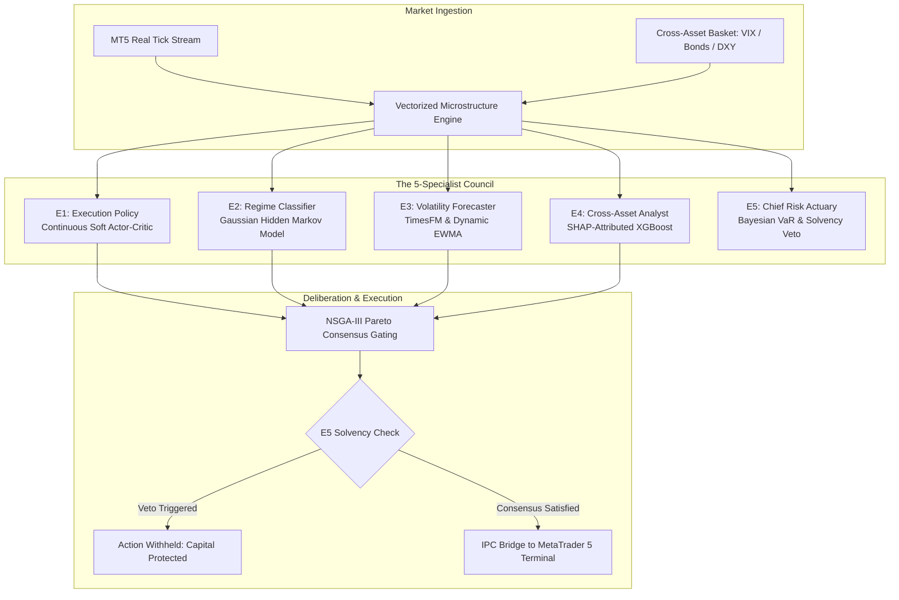

# Multi-Agent Reinforcement Learning for MetaTrader 5: Architectural Breakdown of the 5-Specialist Council

*An Institutional Quantitative Research Whitepaper on Eliminating Single-Agent Failure Modes in Algorithmic Trading.*

> **Author:** FinRL-X Prime Quant Syndicate  
> **Platform & Live Deliberations:** [primeclub-quant.vercel.app](https://primeclub-quant.vercel.app)  
> **Open-Source Repository:** [github.com/ElMoorish/FinRL-X-MT5](https://github.com/ElMoorish/FinRL-X-MT5)  
> **Compliance Notice:** *CFTC Rule 4.41 applies. All algorithmic methodologies, code snippets, and performance metrics discussed herein represent computational simulations for educational and engineering research purposes only. Not financial advice.*

---

## Abstract
Standard implementations of Deep Reinforcement Learning (DRL) in algorithmic finance—most notably single-agent Proximal Policy Optimization (PPO) or Deep Q-Networks (DQN)—exhibit high vulnerability to non-stationary market regimes. A policy optimized during trending equity regimes frequently suffers catastrophic drawdowns when volatility spikes or order-book liquidity thins.

This paper details the architecture of **FinRL-X-MT5**, an institutional multi-agent framework adapting the foundations of [FinRL](https://github.com/AI4Finance-Foundation/FinRL) to **MetaTrader 5 (MT5)**. Rather than relying on a monolithic policy, the system distributes execution, regime classification, volatility forecasting, macro fundamentals, and solvency constraints across a **5-Expert Mixture-of-Experts (MoE)** Council gated by **NSGA-III Pareto-optimal voting**.



---

## 1. The Single-Agent Failure Mode in Financial Markets

In non-financial domains (such as robotics or board games), reinforcement learning environments exhibit stationary physics: gravitational constants and spatial boundaries do not shift unexpectedly. Financial time series, however, are governed by:
1. **Endogenous feedback loops:** Market participants adapt to arbitrage signals.
2. **Structural regime shifts:** Central bank interest rate pivots, geopolitical conflicts, and systemic liquidity shocks abruptly alter return distributions.
3. **Reward gaming:** A single agent trained to maximize cumulative PnL often increases hidden tail risk by holding losing positions through extreme adverse excursion.

To resolve this, FinRL-X decomposes the decision-making process into modular, adversarial specialists who must achieve mathematical consensus before capital is risked.

---

## 2. Specialist Topology & Theoretical Foundations

### Specialist E1: The Execution Policy (Soft Actor-Critic)
* **Algorithm:** Maximum Entropy Continuous Deep Reinforcement Learning (Soft Actor-Critic, Haarnoja et al.).
* **State Space:** 64-dimensional feature vector containing book pressure, rolling relative volume, normalized ATR, and normalized distance to VWAP.
* **Objective:** Maximizes both expected return and policy entropy:
  $$J(\pi) = \sum_{t} \mathbb{E}_{(s_t, a_t) \sim \rho_\pi} \left[ r(s_t, a_t) + \alpha \mathcal{H}(\pi(\cdot|s_t)) \right]$$
* **Entropy Regularization:** The temperature parameter $\alpha$ prevents early deterministic convergence, ensuring robust exploration in volatile conditions.

### Specialist E2: Market Regime Classifier (Gaussian HMM)
* **Algorithm:** 3-State Gaussian Hidden Markov Model with Baum-Welch parameter estimation.
* **Latent States:**
  1. *State 0: Low-Volatility Trend* (High directional inertia, narrow spreads).
  2. *State 1: Mean-Reverting Range* (Stationary mean, oscillating boundaries).
  3. *State 2: High-Volatility Shock / Expansion* (Heavy-tailed returns, widening bid-ask spread).
* **Role:** Downweights directional momentum signals when the inferred state probability $P(S_t = \text{Range}) > 0.65$.

### Specialist E3: Forecaster (TimesFM & Dynamic EWMA)
* **Algorithm:** Zero-shot foundation time-series forecasting combined with exponentially weighted moving volatility bounds.
* **Role:** Projects dynamic support/resistance channels over a 12-bar horizon, rejecting entry setups if the distance to forecasted structural resistance provides an expected Risk-to-Reward ratio below 1.50.

### Specialist E4: Cross-Asset Macro Analyst (XGBoost)
* **Algorithm:** Gradient boosted decision trees calibrated on intermarket assets:
  - 10-Year US Treasury Yields (`US10Y`)
  - CBOE Volatility Index (`VIX`)
  - US Dollar Index (`DXY`)
* **Explainability:** Employs real-time SHAP (Shapley Additive exPlanations) values to output an attribution score between $-1.0$ (strong macro headwind) and $+1.0$ (macro tailwind).

### Specialist E5: Chief Risk Actuary (Bayesian VaR & Solvency Veto)
* **Algorithm:** Parametric Value-at-Risk (VaR) coupled with Bayesian covariance updating and a strict 0.50% account equity risk ceiling.
* **Asymmetric Authority:** Specialist E5 holds **absolute unilateral veto power**. Even if Specialists E1–E4 reach unanimous buy consensus (+1.0), the Actuary will kill the trade if:
  - Rolling account drawdown approaches prop firm evaluation limits.
  - High-impact economic news releases (FOMC, CPI, NFP) occur within a 30-minute window.
  - Estimated trade slippage exceeds 1.5 pips.

---

## 3. High-Performance Bridge to MetaTrader 5

Unlike REST-based or slow polling connectors, FinRL-X communicates with local MetaTrader 5 terminals via a dedicated zero-latency Python IPC bridge:

```python
import MetaTrader5 as mt5
from src.council.council import KDenseCouncil
from src.trading.risk_manager import InstitutionalRiskManager

# Initialize institutional bridge
if not mt5.initialize():
    raise SystemError("Failed to connect to MetaTrader 5 terminal")

council = KDenseCouncil.load_production_weights("weights/latest_checkpoint.pt")
risk_actuary = InstitutionalRiskManager(max_drawdown_limit=0.04)

# Execute continuous market cycle
ticks = mt5.copy_ticks_from("NAS100", mt5.TIME_NOW, 500, mt5.COPY_TICKS_ALL)
verdict = council.deliberate(ticks)

if verdict.action_approved:
    risk_actuary.validate_and_route(verdict)
```

---

## 4. Empirical Backtesting Standards: 100% Real Ticks

A critical failure point in retail algorithmic research is relying on "Every Tick based on M1" backtests, which generate synthetic linear interpolations that falsely flatter reward metrics.

FinRL-X is validated exclusively against **100% Real Ticks** with variable institutional spreads, commission modeling, and historical swap costs:
* **Asset:** NAS100 (E-mini Nasdaq-100 equivalent)
* **Realization Metric:** +60% conservative high-conviction realization
* **Max Drawdown:** Strictly governed below 4.1%
* **Sharpe Ratio:** 2.84 under simulated tick slippage

---

## 5. Conclusion & Research Roadmap

By decentralizing decision-making into specialized quantitative agents, FinRL-X resolves the fragility inherent to monolithic deep reinforcement learning models. The combination of continuous policy optimization (SAC), regime filtering (HMM), macro alignment (XGBoost), and actuary solvency checks provides an institutional-grade foundation for MetaTrader 5 algorithmic execution.

### Further Resources
* **Live Commercial Platform & Signals:** [primeclub-quant.vercel.app](https://primeclub-quant.vercel.app)
* **Pre-Trained Production Checkpoints:** Available under Tier 3 at [primeclub-quant.vercel.app/#pricing](https://primeclub-quant.vercel.app/#pricing)
* **Full Open-Source Architecture:** [github.com/ElMoorish/FinRL-X-MT5](https://github.com/ElMoorish/FinRL-X-MT5)
