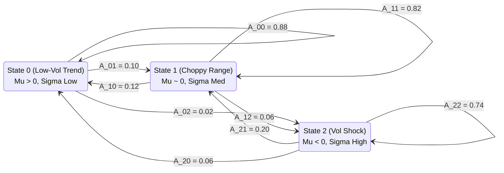

# Hidden Markov Models (HMM) for Regime Detection: Identifying Volatility Transitions on NAS100

*A Quantitative Research Tutorial on Filtering Rangebound Chop and Adapting Algorithmic Strategies to Non-Stationary Markets.*

> **Author:** FinRL-X Prime Quant Syndicate  
> **Platform & Live Deliberation Room:** [primeclub-quant.vercel.app](https://primeclub-quant.vercel.app)  
> **Open-Source Repository:** [github.com/ElMoorish/FinRL-X-MT5](https://github.com/ElMoorish/FinRL-X-MT5)  
> **Compliance Notice:** *CFTC Rule 4.41 applies. All statistical modeling and regime matrices presented represent computational quantitative research for educational evaluation. Not investment advice.*

---

## 1. Introduction: The Regime Dependency Problem

A classic flaw in quantitative finance is assuming that asset returns are independent and identically distributed (i.i.d.) draws from a single stationary distribution. In reality, equity indices like the **NASDAQ-100 (NAS100)** cycle through distinct structural phases:

1. **Persistent Trending Regimes:** High directional autocorrelation, low dispersion, low realized variance. Trend-following momentum strategies thrive.
2. **Mean-Reverting Range Regimes:** High mean reversion, zero directional persistence, clustered chop. Momentum strategies suffer severe whipsaw losses.
3. **Volatility Shock Regimes:** Heavy-tailed return kurtosis, sudden liquidity gaps, correlation breakdown across sectors.

Attempting to trade all three environments with a static set of hyperparameters guarantees drawdown. The **FinRL-X** framework integrates a dedicated **Gaussian Hidden Markov Model (HMM)** agent (Specialist E2) to continuously infer the underlying market regime and modulate Council conviction.

---

## 2. Mathematical Formulation of the Gaussian HMM

Let $S_t \in \{0, 1, 2\}$ represent the hidden market state at time $t$, and $O_t \in \mathbb{R}^d$ represent the observable market emission vector (e.g. log returns and normalized ATR variance).

### The Model Parameters $\lambda = (A, B, \pi)$:
1. **Transition Probability Matrix $A$:**
   $$A_{ij} = P(S_{t+1} = j \mid S_t = i), \quad \sum_{j=0}^{2} A_{ij} = 1$$
2. **Emission Probabilities $B$:**
   Each hidden state generates observations drawn from a multivariate normal distribution:
   $$b_j(O_t) = \mathcal{N}(O_t; \mu_j, \Sigma_j)$$
3. **Initial State Distribution $\pi$:**
   $$\pi_i = P(S_1 = i)$$



---

## 3. Training & Inference: Expectation-Maximization

We calibrate the parameters $\lambda$ using the **Baum-Welch algorithm** (an expectation-maximization method) on 5-minute NAS100 tick-aggregated returns:

```python
import numpy as np
from hmmlearn.hmm import GaussianHMM

class RegimeClassifierHMM:
    def __init__(self, n_states: int = 3):
        self.model = GaussianHMM(
            n_components=n_states,
            covariance_type="full",
            n_iter=200,
            random_state=42
        )
        
    def fit(self, features: np.ndarray):
        """
        Features: 2D array of [Log Returns, Normalized Realized Volatility]
        """
        self.model.fit(features)
        
    def predict_regime_probabilities(self, current_features: np.ndarray) -> np.ndarray:
        """
        Returns posterior state probability distribution [P(S0), P(S1), P(S2)]
        """
        return self.model.predict_proba(current_features)[-1]
```

### Decoded State Semantics on NAS100:
* **State 0 (Bullish Expansion):** Mean log return $> +0.08\%$, standard deviation $\sigma = 0.12\%$. Council grants full momentum sizing (+1.0 multiplier).
* **State 1 (Stationary Consolidation):** Mean log return $\approx 0.00\%$, standard deviation $\sigma = 0.18\%$. Trend trades are downweighted by 60%; mean-reversion range boundaries are prioritized.
* **State 2 (High Volatility Panic):** Mean log return $< -0.15\%$, standard deviation $\sigma = 0.44\%$. Position sizing is reduced by 50% or completely halted by the Actuary.

---

## 4. Gating Council Decisions via Regime Probabilities

In the FinRL-X K-Dense Council, Specialist E2 does not place orders independently. Instead, it acts as a dynamic **Bayesian Gating Filter**:

$$\text{Council Score} = w_{\text{E1}} \cdot \text{Action}_{\text{SAC}} \times \left(1 - P(S_t = \text{Range})\right) + w_{\text{E4}} \cdot \text{Macro}_{\text{XGB}}$$

When the HMM detects a transition into a chop regime ($P(S_t = \text{State 1}) > 0.65$), the directional weight of the deep reinforcement learning agent (E1) is suppressed, preventing false breakout entries during low-liquidity Tokyo or pre-London sessions.

---

## 5. Real-Time Deployment on MetaTrader 5

During live execution, tick features are continuously streamed to Python via the MT5 bridge, where the forward algorithm updates posterior state probabilities in under **12 milliseconds**.

When state transitions occur, alerts are instantly emitted to the local dashboard and broadcast to VIP subscriber channels to alert traders of changing market conditions before traditional lagging indicators like moving averages adjust.

### Explore More:
* **Live Council Deliberation Feed:** Observe real-time HMM state classifications at [primeclub-quant.vercel.app](https://primeclub-quant.vercel.app)
* **Pre-Trained Regime Matrices:** Checkpoint weights available via [primeclub-quant.vercel.app/#pricing](https://primeclub-quant.vercel.app/#pricing)
* **Source Implementation:** Explore `src/models/hmm_regime.py` at [github.com/ElMoorish/FinRL-X-MT5](https://github.com/ElMoorish/FinRL-X-MT5)
